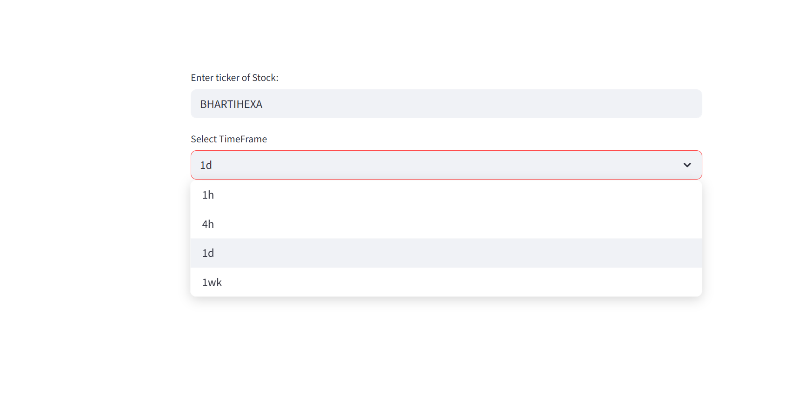
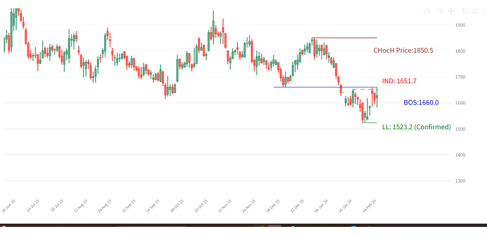

# Quantitative Analysis & Algorithmic Trading Tools

This repository contains a collection of Python-based tools developed to automate technical analysis, identify institutional market structure, and model portfolio risk. These tools leverage **Smart Money Concepts (SMC)**, **Market Microstructure**, and **Statistical Risk Metrics**.

## 🛠️ Tech Stack
* **Language:** Python
* **Libraries:** Pandas, NumPy, Plotly, Streamlit, yfinance, TA-Lib
* **Visualization:** Interactive financial charting with Plotly Graph Objects

---

## 1. Automated Bearish SMC Structure Mapper
**File:** `bearish_smc_structure_mapper.py`

### 📉 Objective
To eliminate subjectivity in identifying bearish trend continuation by algorithmically mapping **Smart Money Concepts (SMC)** logic.

### 🧠 Algorithmic Logic
This tool uses a state-machine algorithm to track market structure shifts:
* **Confirmed Lower Low (LL):** A "Weak Low" is only confirmed as a structural Low after price sweeps **Inducement (Buy-Side Liquidity)** to the upside.
* **Bearish Break of Structure (BOS):** Signals a trend continuation only when a candle *closes* below a Confirmed Lower Low.
* **Visual Output:** Dynamically plots Inducement levels (Red Dashed Lines) and Structural Lows (Green/Orange Lines) to identify high-probability shorting zones.

### 📸 Visual Demo
*(These charts are generated automatically by the script)*


*Figure 1: Streamlit Layout for Ticker Input and TimeFrame Selection.*


*Figure 2: Real-time mapping of structural points on Bharti Hexacom .*

---

## 2. OBV Momentum & Divergence Strategy
**File:** `obv_momentum_strategy.py`

### 📈 Objective
To filter "false breakouts" by validating price trends with volume flow analysis.

### 🧠 Algorithmic Logic
* **Signal Engine:** Combines **Price Action** (Higher Lows) with **On-Balance Volume (OBV)** slope analysis.
* **Trend Confirmation:** The algorithm triggers a "Buy" signal only when a price breakout is statistically supported by a corresponding expansion in volume pressure.
* **Output:** Plots precise entry markers directly on the candlestick chart.

---

## 3. Portfolio Beta & Risk Calculator
**File:** `beta_calculator.py`

### 🛡️ Objective
To quantify portfolio exposure and systematic risk against the benchmark index (Nifty 50).

### 🧠 Algorithmic Logic
* **Data Pipeline:** Fetches  historical data for a custom basket of stocks.
* **Statistical Modeling:** Calculates the **Beta (β)** and **Correlation Coefficient (ρ)** of each asset relative to the Nifty 50.
* **Application:** Used for data-driven position sizing and determining if a portfolio leans "Aggressive" (High Beta) or "Defensive" (Low Beta).

---

## 🚀 How to Run
1.  **Clone the repository:**
    ```bash
    git clone [https://github.com/yash27804/financial-market.git](https://github.com/yash27804/financial-market.git)
    ```
2.  **Install dependencies:**
    ```bash
    pip install -r requirements.txt
    ```
3.  **Run the Streamlit Apps:**
    ```bash
    streamlit run bearish_smc_structure_mapper.py
    ```
